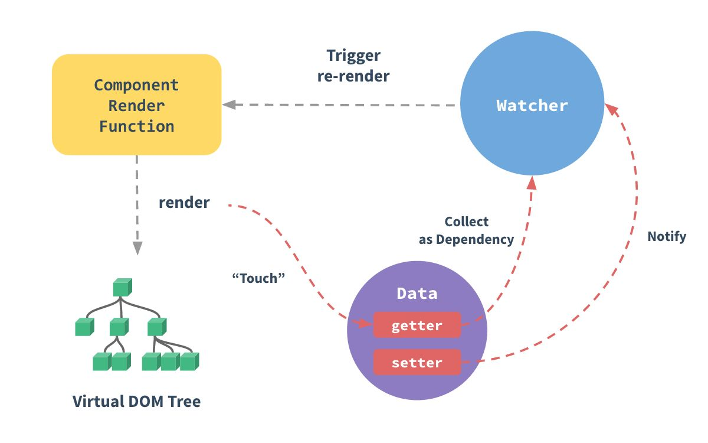

## 变化侦测
首先，我们定义一个数据对象car：
```javascript
let car = {
  'brand':'BMW',
  'price':3000
}
```
接下来，我们使用Object.defineProperty()改写上面的例子：
```javascript
let car = {}
let val = 3000
Object.defineProperty(car, 'price', {
  enumerable: true,
  configurable: true,
  get(){
    console.log('price属性被读取了')
    return val
  },
  set(newVal){
    console.log('price属性被修改了')
    val = newVal
  }
})
```
通过Object.defineProperty()方法给car定义了一个price属性，并把这个属性的读和写分别使用get()和set()进行拦截，每当该属性进行读或写操作的时候就会触发get()和set()。
### observer类

```javascript
// 源码位置：src/core/observer/index.js

/**
 * Observer类会通过递归的方式把一个对象的所有属性都转化成可观测对象
 */
export class Observer {
  constructor (value) {
    this.value = value
    // 给value新增一个__ob__属性，值为该value的Observer实例
    // 相当于为value打上标记，表示它已经被转化成响应式了，避免重复操作
    def(value,'__ob__',this)
    if (Array.isArray(value)) {
      // 当value为数组时的逻辑
      // ...
    } else {
      this.walk(value)
    }
  }

  walk (obj: Object) {
    const keys = Object.keys(obj)
    for (let i = 0; i < keys.length; i++) {
      defineReactive(obj, keys[i])
    }
  }
}
/**
 * 使一个对象转化成可观测对象
 * @param { Object } obj 对象
 * @param { String } key 对象的key
 * @param { Any } val 对象的某个key的值
 */
function defineReactive (obj,key,val) {
  // 如果只传了obj和key，那么val = obj[key]
  if (arguments.length === 2) {
    val = obj[key]
  }
  if(typeof val === 'object'){
      new Observer(val)
  }
  Object.defineProperty(obj, key, {
    enumerable: true,
    configurable: true,
    get(){
      console.log(`${key}属性被读取了`);
      return val;
    },
    set(newVal){
      if(val === newVal){
          return
      }
      console.log(`${key}属性被修改了`);
      val = newVal;
    }
  })
}
```
observer类，它用来将一个正常的object转换成可观测的object，并且给value新增一个__ob__属性，值为该value的Observer实例。这个操作相当于为value打上标记，表示它已经被转化成响应式了，避免重复操作。
然后判断数据的类型，只有object类型的数据才会调用walk将每一个属性转换成getter/setter的形式来侦测变化。 最后，在defineReactive中当传入的属性值还是一个object时使用new observer（val）来递归子属性，这样我们就可以把obj中的所有属性（包括子属性）都转换成getter/seter的形式来侦测变化。 也就是说，只要我们将一个object传到observer中，那么这个object就会变成可观测的、响应式的object。
## 依赖收集
谁用到了这个数据，那么当这个数据变化时就通知谁。所谓谁用到了这个数据，其实就是谁获取了这个数据，而可观测的数据被获取时会触发getter属性，那么我们就可以在getter中收集这个依赖。同样，当这个数据变化时会触发setter属性，那么我们就可以在setter中通知依赖更新。

总结一句话就是：在getter中收集依赖，在setter中通知依赖更新。
### dep类
```javascript
// 源码位置：src/core/observer/dep.js
export default class Dep {
  constructor () {
    this.subs = []
  }

  addSub (sub) {
    this.subs.push(sub)
  }
  // 删除一个依赖
  removeSub (sub) {
    remove(this.subs, sub)
  }
  // 添加一个依赖
  depend () {
    if (window.target) {
      this.addSub(window.target)
    }
  }
  // 通知所有依赖更新
  notify () {
    const subs = this.subs.slice()
    for (let i = 0, l = subs.length; i < l; i++) {
      subs[i].update()
    }
  }
}

/**
 * Remove an item from an array
 */
export function remove (arr, item) {
  if (arr.length) {
    const index = arr.indexOf(item)
    if (index > -1) {
      return arr.splice(index, 1)
    }
  }
}
```

在上面的依赖管理器Dep类中，我们先初始化了一个subs数组，用来存放依赖，并且定义了几个实例方法用来对依赖进行添加，删除，通知等操作。

有了依赖管理器后，我们就可以在getter中收集依赖，在setter中通知依赖更新了，代码如下
```javascript
function defineReactive (obj,key,val) {
  if (arguments.length === 2) {
    val = obj[key]
  }
  if(typeof val === 'object'){
    new Observer(val)
  }
  const dep = new Dep()  //实例化一个依赖管理器，生成一个依赖管理数组dep
  Object.defineProperty(obj, key, {
    enumerable: true,
    configurable: true,
    get(){
      dep.depend()    // 在getter中收集依赖
      return val;
    },
    set(newVal){
      if(val === newVal){
          return
      }
      val = newVal;
      dep.notify()   // 在setter中通知依赖更新
    }
  })
}
```
在上述代码中，我们在getter中调用了dep.depend()方法收集依赖，在setter中调用dep.notify()方法通知所有依赖更新。

## 依赖到底是谁
其实在Vue中还实现了一个叫做Watcher的类，而Watcher类的实例就是我们上面所说的那个"谁"。换句话说就是：谁用到了数据，谁就是依赖，我们就为谁创建一个Watcher实例。在之后数据变化时，我们不直接去通知依赖更新，而是通知依赖对应的Watch实例，由Watcher实例去通知真正的视图。
### watcher类
```javascript
export default class Watcher {
  constructor (vm,expOrFn,cb) {
    this.vm = vm;
    this.cb = cb;
    this.getter = parsePath(expOrFn)
    this.value = this.get()
  }
  get () {
    window.target = this;
    const vm = this.vm
    let value = this.getter.call(vm, vm)
    window.target = undefined;
    return value
  }
  update () {
    const oldValue = this.value
    this.value = this.get()
    this.cb.call(this.vm, this.value, oldValue)
  }
}

/**
 * Parse simple path.
 * 把一个形如'data.a.b.c'的字符串路径所表示的值，从真实的data对象中取出来
 * 例如：
 * data = {a:{b:{c:2}}}
 * parsePath('a.b.c')(data)  // 2
 */
const bailRE = /[^\w.$]/
export function parsePath (path) {
  if (bailRE.test(path)) {
    return
  }
  const segments = path.split('.')
  return function (obj) {
    for (let i = 0; i < segments.length; i++) {
      if (!obj) return
      obj = obj[segments[i]]
    }
    return obj
  }
}
```
谁用到了数据，谁就是依赖，我们就为谁创建一个Watcher实例，在创建Watcher实例的过程中会自动的把自己添加到这个数据对应的依赖管理器中，以后这个Watcher实例就代表这个依赖，当数据变化时，我们就通知Watcher实例，由Watcher实例再去通知真正的依赖。

### Watcher类的代码实现逻辑：

1. 当实例化Watcher类时，会先执行其构造函数；
2. 在构造函数中调用了this.get()实例方法；
3. 在get()方法中，首先通过window.target = this把实例自身赋给了全局的一个唯一对象window.target上，然后通过let value = this.getter.call(vm, vm)获取一下被依赖的数据，获取被依赖数据的目的是触发该数据上面的getter，上文我们说过，在getter里会调用dep.depend()收集依赖，而在dep.depend()中取到挂载window.target上的值并将其存入依赖数组中，在get()方法最后将window.target释放掉。
4. 而当数据变化时，会触发数据的setter，在setter中调用了dep.notify()方法，在dep.notify()方法中，遍历所有依赖(即watcher实例)，执行依赖的update()方法，也就是Watcher类中的update()实例方法，在update()方法中调用数据变化的更新回调函数，从而更新视图。


## 总结
总结一下就是：Watcher先把自己设置到全局唯一的指定位置（window.target），然后读取数据。因为读取了数据，所以会触发这个数据的getter。接着，在getter中就会从全局唯一的那个位置读取当前正在读取数据的Watcher，并把这个watcher收集到Dep中去。收集好之后，当数据发生变化时，会向Dep中的每个Watcher发送通知。通过这样的方式，Watcher可以主动去订阅任意一个数据的变化。为了便于理解，从官网找到一张流程图，如下图：

